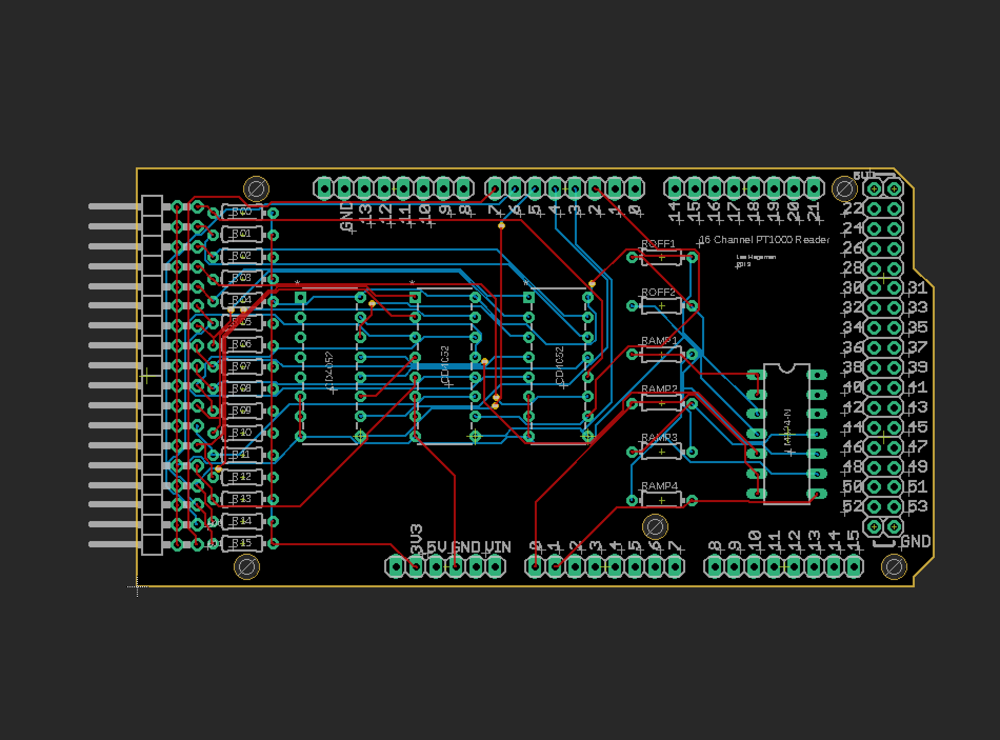

# 16 Channel PT1000 Reader

This project describes an Arduino shield which allows the reading of up to 16 PT1000 2 wire RTD temperature sensors, and communicate that information to a computer. It also has two digital outputs, designed to control relays which can turn heaters on and off. This design allows the Arduino to autonomously control the heaters, ensuring consistent temperature control even if the main computer loses connection.

  

## Getting Started

### Materials

To make the Arduino shield, you need the following items:

- 1 Arduino Due or Arduino Mega (with corresponding cable, and power supply if you'd like continued operation in the event of a computer failure)
- 1 Printed Circuit Board (see .brd file)
- 1 LM324 Op Amp chip [link](https://www.digikey.com/product-detail/en/texas-instruments/LM324N/296-1391-5-ND/277627)
- 3 CD4052B Multiplexing chips [link](https://www.digikey.com/product-detail/en/texas-instruments/CD4051BE/296-2057-5-ND/67305)
- 18 0.1" double right angle connectors [link](https://www.digikey.com/products/en?mpart=PREC040SFAN-RC&v=35)
- 40 0.1" straight connectors [link](https://www.digikey.com/products/en?mpart=PREC040SFAN-RC&v=35)
- 16 1kΩ resistors
- 6 amplification resistors (optional, see "choosing resistors" section)

### Choosing Resistors

For the 16 1kΩ resistors, you can measure and record their specific resistances after installation for increased accuracy, so there is no special process to choose them.

The Arduino will constantly measure an unamplified temperature, which has a resolution which varies from about 0.1°C near -200°C, to about 1°C near 40°C (this is calculated using 10 bit resolution, an Arduino Due can be configured to use 12 bits instead, giving 100 times finer resolution). 

  

Serial monitor output comparing amplified and unamplified measurements. These curves were obtained by pinching a PT1000 with my fingers and then releasing. The overall offset can likely be fixed with calibration. (Image will be updated to a cleaner one soon.)

To improve this resolution, the Arduino will also measure an amplified temperature, which lets you effectively "zoom in" on an specific temperature range (see above comparison). There is a several step process to determine the ideal resistors for a given temperature range of interest.

1. Decide on Tmin and Tmax, the minimum and maximum temperatures you plan to measure with your amplified circuit.
2. Calculate the Rmin and Rmax, the corresponding minimum and maximum PT1000 resistances (use something like [this table](https://web.mst.edu/~cottrell/ME240/Resources/Temperature/RTD%20table.pdf))
3. Calculate Vmin and Vmax, the corresponding voltages read by the Arduino. Use the formula V=R/(R+1000Ω)*(3.3 Volts).
4. We have our unamplified voltage range, and we will use our amplifier to convert this to our desired voltage range of 0.1V-1.7V (the op-amp only gets within 1.5V of the maximum, so the measurable range is 0-1.8V, and we give each side 0.1V of buffer). So, the desired amplification factor is A=(Vmax- Vmin)/(1.6 Volts). We also have an ideal offset voltage Voff  equal to Vmin.
5. Now that we have ideal A and Voff values chosen, we must modify them to make their values easy to construct with available resistors. We must choose resistors with resistance values R1, R2, Roff1, and Roff2 such that A=R2/R1 and  Voff=Vmin. It is perfectly fine to decrease A and adjust Voff in order to accomplish this without having to use nonstandard resistors, it will just slightly change the range of voltages, which is why we gave each side 0.1V of buffer in step 4. 
6. To check that your resistance values will work as expected, recalculate your amplified voltage range. The amplified voltage will be Vamp = R2/R1 * (V - (3.3 Volts) * Roff2 / (Roff1 + Roff2 )) where V is the unamplified voltage. It's a good idea to use that formula to double check that the amplified voltage will stay in the range 0 to 1.7 Volts for the expected unamplified voltages from step 3.

Now that we have our desired resistor values, R1, R2, Roff1, and Roff2, we need to choose resistors with those resistance values. We need a pair of resistors, Ramp1 and Ramp2, to have resistances as close as possible to R1, and another pair Ramp3 and Ramp4, to have resistances as close as possible to Ramp1 and R2. It is worth taking some time to match the resistances of each pair, as the linearity of the amplifier depends on their values being equal. Once you have also chosen Roff1 and Roff2, take the time to measure and record the resistances of each resistor, as their precise values are used by the arduino program to reconstruct the temperature from the amplified voltage, and the resistances cannot be simply measured after soldering.

### Assembly

Soldering can be done in any order, but I recommend soldering the pin connectors last as they can give you less room to solder the 16 1kΩ resistors.

### Program Modification

In the Arduino file, you should modify the parameters to correspond to your measured resistances and active channels. You can also switch between LabVIEW output and serial monitor output.

I plan to improve the readability of the arduino code once the LabVIEW integration is finalized.

### Calibration

Will be updated soon. I should be able to use a known temperature to calibrate the temperature measurements, as well as matching the amplified measurement to the unamplified measurement just using the ambient room temperature.

## LabVIEW Integration

Will be updated soon. I plan to support output of temperature as well as input of desired temperature windows.

## Acknowledgments

* Domenico Franco helped me iterate the PCB design.

